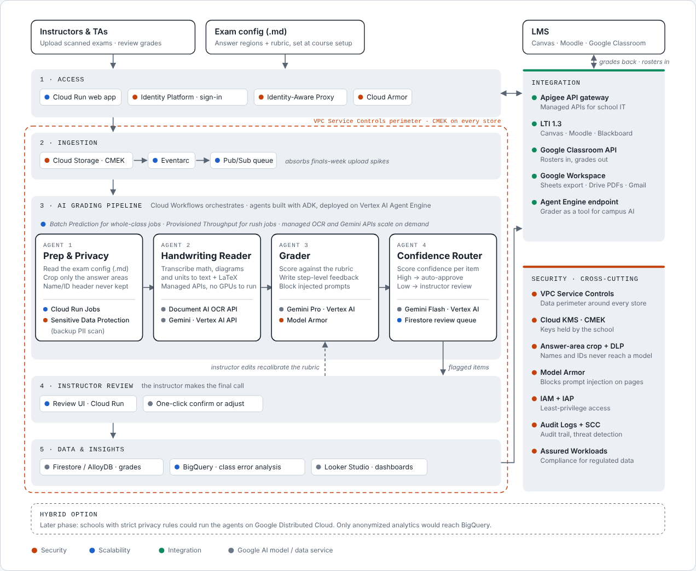

# Architecture

## Request flow

1. **Access.** The instructor signs in (Identity Platform, behind IAP and Cloud Armor) and uses the web app on Cloud Run.
2. **Exam config.** At course setup the instructor uploads one Markdown file per exam: the answer region for each question, the reference answer, and the rubric. See [`examples/phys101_midterm1.md`](../examples/phys101_midterm1.md).
3. **Ingestion.** Scans go to Cloud Storage, encrypted with a CMEK key the school controls. The API writes `manifest.json` last; its finalize event fires Eventarc (delivered over Pub/Sub), which starts the Cloud Workflow.
4. **AI grading pipeline.** The workflow calls the four agents in order through `POST /internal/agents/{step}`, each with its own retries.
5. **Instructor review.** Items Agent 4 flags appear in the review queue. The instructor confirms or adjusts each score. Edits are stored as calibration examples.
6. **Data and LMS.** Grades live in Firestore and export as CSV (for any LMS or Google Sheets) or go to Google Classroom as draft grades.

## The four agents

| Agent | Job | Google Cloud services | Code |
|---|---|---|---|
| 1. Prep & Privacy | Reads the exam config and keeps only the listed answer areas, so the name and student ID header is never cropped or sent to a model. A Sensitive Data Protection scan on each crop is a backup for names written inside an answer. | Cloud Run, Sensitive Data Protection | [`agent1_prep.py`](../app/agents/agent1_prep.py) |
| 2. Handwriting Reader | Reads each crop with the Document AI OCR API, then Gemini rewrites it as a clean transcript with LaTeX math. Managed APIs only; nothing is self-hosted. | Document AI, Gemini on Vertex AI | [`agent2_reader.py`](../app/agents/agent2_reader.py) |
| 3. Grader | Screens the transcript with Model Armor, then scores each rubric criterion with Gemini and writes feedback. Past instructor edits are included as examples. | Gemini on Vertex AI, Model Armor | [`agent3_grader.py`](../app/agents/agent3_grader.py) |
| 4. Confidence Router | Combines reading and grading confidence with an independent Gemini Flash second opinion. Routes each item to auto-approve, spot check, or instructor review. | Gemini Flash on Vertex AI, Firestore | [`agent4_router.py`](../app/agents/agent4_router.py) |

## Security

- **Answer-area allowlist.** Agent 1 crops only the regions in the exam config. Identity never enters the pipeline: `student_ref` is stored on the submission for the instructor, and agents receive only the submission id and the crops.
- **Prompt injection.** Model Armor screens every transcript. Flagged answers score 0, get confidence 0, and go to the instructor. Grading prompts also mark the answer as data.
- **Encryption.** The bucket's default key is a Cloud KMS key with 90-day rotation (`infra/terraform/main.tf`).
- **Least privilege.** Separate service accounts for the API, the workflow, and the trigger. Only the workflow's account can call the API's internal routes.
- **Perimeter.** `infra/terraform/vpc_sc.tf.example` puts Storage, Firestore, Vertex AI, Document AI, DLP, and BigQuery inside a VPC Service Controls perimeter. It needs an organization policy, so it is opt-in.

## Scalability

- Uploads return immediately; grading is asynchronous through Eventarc and Workflows.
- Cloud Run scales from 0 to 50 instances (raise `max_instance_count` for finals week).
- OCR and Gemini are managed APIs, so capacity is a quota setting, not a GPU fleet. For whole-class jobs that are not urgent, Vertex AI Batch Prediction is the next step; for rush jobs, Provisioned Throughput.

## Integration

- CSV gradebook export: `GET /exams/{exam_id}/grades.csv`
- Google Classroom: `POST /exams/{exam_id}/classroom` writes draft grades.
- Roadmap: LTI 1.3 launch and grade passback for Canvas, Moodle, and Blackboard; Apigee in front of the public API; BigQuery export for class-level error analysis.
